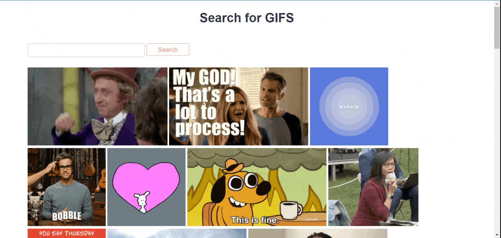

# Giphy Gif Search

This program showcases relevant GIFs from [GIPHY](https://developers.giphy.com/docs/sdk/) based on the user's search term. If nothing is provided, the trending GIFs are posted instead. This app uses [giphy-api](https://github.com/austinkelleher/giphy-api) to call the APIs.

## Directions

### Live Demo

Open [https://glacial-garden-54215.onrender.com/](https://glacial-garden-54215.onrender.com/).

### Running Locally

1. Obtain an API key from [GIPHY](https://developers.giphy.com/).
2. Create a `.env` file with the line `GIPHY_API_KEY=<YOUR_API_KEY>`.
3. Install node dependencies: `npm install`.
4. Run the server: `node app.js`.
5. Open _localhost:3000_ in the browser to access the site.

Press Ctrl+C to stop the server when done.

### Docker

1. Obtain an API key from [GIPHY](https://developers.giphy.com/).
2. Create a `.env` file with the line `GIPHY_API_KEY=<YOUR_API_KEY>`.
3. Build the docker image: `docker build . -t <your username>/node-web-app`.
4. Run the image: `docker run --rm -p 8080:8080 -d <your username>/node-web-app`.
5. Open _localhost:8080_ in the browser to access the site.

Run `docker kill <container id>` to shut down the image when done. The container ID can be found using `docker ps`.
